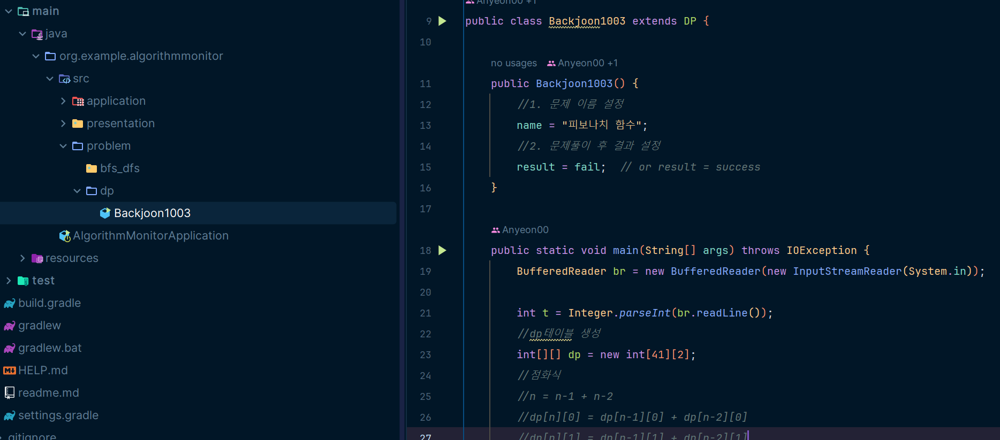
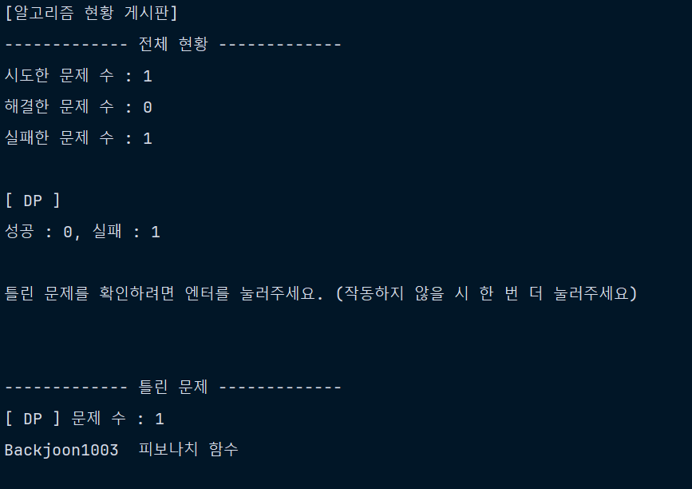
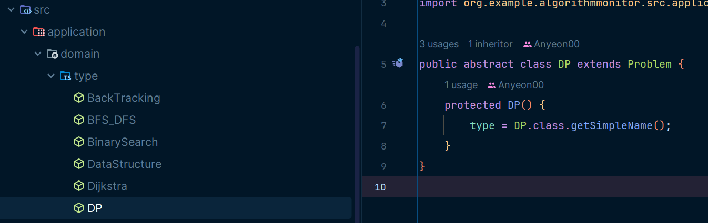

## 제작 동기 및 목적
깃허브에 알고리즘 코드만 올리기는 뭐해서, 올린 코드 현황을 파악할 수 있는 프로그램을 간단히 제작해 봄


## 기능
### 1. 전체 현황 확인
- 시도한 문제 수
- 해결한 문제 수
- 실패한 문제 수
- 유형별 성공 및 실패한 문제 수

### 2. 실패한 문제 현황 확인
- 유형 별로 틀린 문제 정보 확인

## 사용법
0. src/problem/문제유형 패키지에서 사용하기 (알고리즘 코드 작성하기)
1. Class 이름으로 문제 번호를 작성 후, 문제 유형을 상속 <br>
```java 
    public class Backjoon1003 extends DP
    //문제 유형은 application/domain/type 패키지에서 확인 가능
    //유형이 존재하지 않는 경우 "Problem" 상속
```
2. 생성자를 만들고, name 변수에 문제 이름을 작성 <br>
```java
    public Backjoon1003(){ 
        name = "피보나치 함수"; 
    }
```
3. 일반적으로 문제 풀듯이 메인 메소드를 작성하고 문제 풀기
4. 생성자에서 result 변수에 성공 혹은 실패 결과를 작성 <br>
```java
    public Backjoon1003(){ 
        name = "피보나치 함수";
        result = success;   // or result = fail (기본값: fail)
    }
```
### 예시

5. 스프링부트 어플리케이션을 실행하면, 자동으로 콘솔에 현황이 출력됨 <br>
### 예시


## 프로그램 특징
- 일반적인 프로그램처럼 runtime시에 활용하는 프로그램이 아님
- 코드를 작성하고 (알고리즘 문제를 풀고), runtime시 작성한 코드(알고리즘) 현황을 확인하는 용도의 프로그램

## 기타
### 문제 유형 추가하는 방법
1. src/application/domain/type 에 문제유형들이 존재
2. 유형이름을 클래스 이름으로 작성
3. Problem 을 상속
4. 생성자에서 type 변수를 설정 <br>
### 예시


### 문제에 대한 정보를 추가하는 방법
문제를 시도한 날짜, 간단한 메모 등을 추가하고 싶다면..

문제에 대한 정보는 Problem 클래스의 데이터 멤버에 존재함
여기에 추가하고, 나머지는 전체 코드를 뜯어보면서 작성하길 바람 <br>
(MVC 구조로 작성되어 있기 때문에, 스프링 MVC에 능숙한 개발자라면 충분히 가능할 것이라 사료됨)

## 여담
1. 원래는 성공 및 실패 여부를 직접 작성하는 것이 아닌, 멀티 스레드를 이용하여 작성한 코드를 실행하여 input 과 output을 비교해 판단하고자 했음.
   그러나 다음과 같은 문제들로 인해 구현하지 않음
- input 과 정답 output을 사용자가 일일이 입력해주어야 하는 불편함
- input이 처음부터 주어지는 프로그래머스와 달리 백준은 input (readLine()) 코드의 삽입이 자유로운데, 본 프로그램의 구현상 이를 일괄적으로 처리하기 어려움이 있음
- fail의 존재 이유는, 지금 당장 해결하지 못해 기록해놓았다가 나중에 다시 확인하기 위한 의도임. 따라서 사용자가 자유롭게 설정 가능하도록 하는 편이 낫다고 판단하여 이와 같이 구현함.

2. 문제 유형을 상속을 통해서도 알 수 있고, 데이터 멤버를 통해서도 알 수 있는데 정보를 중복되게 구현하였나?
   사용자가 작성한 코드의 클래스들은 Problem을 상속받는데 어떤 유형의 문제인지도 분류가 되어야 할 것 같아서 중간에 추가함(그냥 내 마음임). 그리고 문제유형을 일일이 리플렉션으로 확인하기는 비효율적이니까 데이터멤버에도 추가해놓음. (대신 이 때 리플렉션를 이용해 자동으로 데이터멤버에 설정해 줌)

3. 추후 GUI 프로그램으로 개선할 여지 있음 <br>
   (MVC 구조이기 때문에 presentation 패키지의 ConsoleBoard만 swing으로 갈아끼면 됨)


